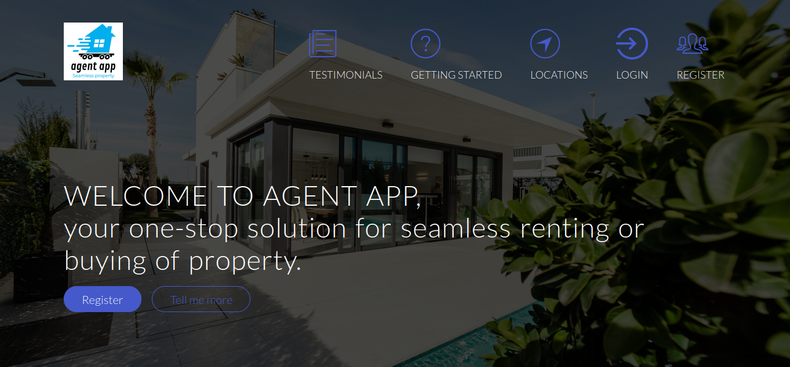

# portfolio-project

## Agent app
An application where real estate agent post available real estate properties such has an apartment, a house or land for sale or lease and potential customers can see the posts then they can contact the agent to make their deal.

 

 You can read my blog for this project post [here](https://yalectdev.medium.com/portfolio-project-mvp-completed-11e5ad3cd1e4)

## Table of Content
* [Description](#agent-app)
* [Environment](#environment)
* [Installation](#installation)
* [File Descriptions](#file-descriptions)
* [Usage](#usage)
* [Examples of use](#examples-of-use)
* [Bugs](#bugs)
* [Authors](#authors)
* [License](#license)

## Environment
This project is interpreted/tested on Ubuntu 22.04 LTS using python3 (version 3.10.12)

## Installation
1. Start up python virtual environment
  ```
  python3 -m venv venv
  ```
2. Start the virtual environment
  ```
  source venv/bin/activate
  ```
3. Install squelite
  ```
  sudo apt install sqlite3
  ```
4. Install all dependencies
  ```
  pip install -r requirements.txt
  ```
5. Start the app
  ```
  flask run
  ```
## Bugs
1. When I run the command
    ```
    flask db downgrade base
    ```
    I get the error
```
    INFO  [alembic.runtime.migration] Context impl SQLiteImpl.
INFO  [alembic.runtime.migration] Will assume non-transactional DDL.
INFO  [alembic.runtime.migration] Running downgrade 0617328a1657 -> 9b220813f361, posts table
Traceback (most recent call last):
  File "/home/yalect/Documents/alx_se/portfolio_project_v1/venv/lib/python3.10/site-packages/sqlalchemy/engine/base.py", line 1967, in _exec_single_context
    self.dialect.do_execute(
  File "/home/yalect/Documents/alx_se/portfolio_project_v1/venv/lib/python3.10/site-packages/sqlalchemy/engine/default.py", line 924, in do_execute
    cursor.execute(statement, parameters)
sqlite3.OperationalError: table _alembic_tmp_agent already exists

The above exception was the direct cause of the following exception:

Traceback (most recent call last):
  File "/home/yalect/Documents/alx_se/portfolio_project_v1/venv/bin/flask", line 8, in <module>
    sys.exit(main())
  File "/home/yalect/Documents/alx_se/portfolio_project_v1/venv/lib/python3.10/site-packages/flask/cli.py", line 1105, in main
    cli.main()
  File "/home/yalect/Documents/alx_se/portfolio_project_v1/venv/lib/python3.10/site-packages/click/core.py", line 1078, in main
    rv = self.invoke(ctx)
  File "/home/yalect/Documents/alx_se/portfolio_project_v1/venv/lib/python3.10/site-packages/click/core.py", line 1688, in invoke
    return _process_result(sub_ctx.command.invoke(sub_ctx))
  File "/home/yalect/Documents/alx_se/portfolio_project_v1/venv/lib/python3.10/site-packages/click/core.py", line 1688, in invoke
    return _process_result(sub_ctx.command.invoke(sub_ctx))
  File "/home/yalect/Documents/alx_se/portfolio_project_v1/venv/lib/python3.10/site-packages/click/core.py", line 1434, in invoke
    return ctx.invoke(self.callback, **ctx.params)
  File "/home/yalect/Documents/alx_se/portfolio_project_v1/venv/lib/python3.10/site-packages/click/core.py", line 783, in invoke
    return __callback(*args, **kwargs)
  File "/home/yalect/Documents/alx_se/portfolio_project_v1/venv/lib/python3.10/site-packages/click/decorators.py", line 33, in new_func
    return f(get_current_context(), *args, **kwargs)
  File "/home/yalect/Documents/alx_se/portfolio_project_v1/venv/lib/python3.10/site-packages/flask/cli.py", line 386, in decorator
    return ctx.invoke(f, *args, **kwargs)
  File "/home/yalect/Documents/alx_se/portfolio_project_v1/venv/lib/python3.10/site-packages/click/core.py", line 783, in invoke
    return __callback(*args, **kwargs)
  File "/home/yalect/Documents/alx_se/portfolio_project_v1/venv/lib/python3.10/site-packages/flask_migrate/cli.py", line 172, in downgrade
    _downgrade(directory, revision, sql, tag, x_arg)
  File "/home/yalect/Documents/alx_se/portfolio_project_v1/venv/lib/python3.10/site-packages/flask_migrate/__init__.py", line 111, in wrapped
    f(*args, **kwargs)
  File "/home/yalect/Documents/alx_se/portfolio_project_v1/venv/lib/python3.10/site-packages/flask_migrate/__init__.py", line 210, in downgrade
    command.downgrade(config, revision, sql=sql, tag=tag)
  File "/home/yalect/Documents/alx_se/portfolio_project_v1/venv/lib/python3.10/site-packages/alembic/command.py", line 449, in downgrade
    script.run_env()
  File "/home/yalect/Documents/alx_se/portfolio_project_v1/venv/lib/python3.10/site-packages/alembic/script/base.py", line 583, in run_env
    util.load_python_file(self.dir, "env.py")
  File "/home/yalect/Documents/alx_se/portfolio_project_v1/venv/lib/python3.10/site-packages/alembic/util/pyfiles.py", line 95, in load_python_file
    module = load_module_py(module_id, path)
  File "/home/yalect/Documents/alx_se/portfolio_project_v1/venv/lib/python3.10/site-packages/alembic/util/pyfiles.py", line 113, in load_module_py
    spec.loader.exec_module(module)  # type: ignore
  File "<frozen importlib._bootstrap_external>", line 883, in exec_module
  File "<frozen importlib._bootstrap>", line 241, in _call_with_frames_removed
  File "/home/yalect/Documents/alx_se/portfolio_project_v1/migrations/env.py", line 113, in <module>
    run_migrations_online()
  File "/home/yalect/Documents/alx_se/portfolio_project_v1/migrations/env.py", line 107, in run_migrations_online
    context.run_migrations()
  File "<string>", line 8, in run_migrations
  File "/home/yalect/Documents/alx_se/portfolio_project_v1/venv/lib/python3.10/site-packages/alembic/runtime/environment.py", line 948, in run_migrations
    self.get_context().run_migrations(**kw)
  File "/home/yalect/Documents/alx_se/portfolio_project_v1/venv/lib/python3.10/site-packages/alembic/runtime/migration.py", line 627, in run_migrations
    step.migration_fn(**kw)
  File "/home/yalect/Documents/alx_se/portfolio_project_v1/migrations/versions/0617328a1657_posts_table.py", line 45, in downgrade
    with op.batch_alter_table('agent', schema=None) as batch_op:
  File "/usr/lib/python3.10/contextlib.py", line 142, in __exit__
    next(self.gen)
  File "/home/yalect/Documents/alx_se/portfolio_project_v1/venv/lib/python3.10/site-packages/alembic/operations/base.py", line 398, in batch_alter_table
    impl.flush()
  File "/home/yalect/Documents/alx_se/portfolio_project_v1/venv/lib/python3.10/site-packages/alembic/operations/batch.py", line 164, in flush
    batch_impl._create(self.impl)
  File "/home/yalect/Documents/alx_se/portfolio_project_v1/venv/lib/python3.10/site-packages/alembic/operations/batch.py", line 448, in _create
    op_impl.create_table(self.new_table)
  File "/home/yalect/Documents/alx_se/portfolio_project_v1/venv/lib/python3.10/site-packages/alembic/ddl/impl.py", line 366, in create_table
    self._exec(schema.CreateTable(table))
  File "/home/yalect/Documents/alx_se/portfolio_project_v1/venv/lib/python3.10/site-packages/alembic/ddl/impl.py", line 207, in _exec
    return conn.execute(construct, multiparams)
  File "/home/yalect/Documents/alx_se/portfolio_project_v1/venv/lib/python3.10/site-packages/sqlalchemy/engine/base.py", line 1418, in execute
    return meth(
  File "/home/yalect/Documents/alx_se/portfolio_project_v1/venv/lib/python3.10/site-packages/sqlalchemy/sql/ddl.py", line 180, in _execute_on_connection
    return connection._execute_ddl(
  File "/home/yalect/Documents/alx_se/portfolio_project_v1/venv/lib/python3.10/site-packages/sqlalchemy/engine/base.py", line 1529, in _execute_ddl
    ret = self._execute_context(
  File "/home/yalect/Documents/alx_se/portfolio_project_v1/venv/lib/python3.10/site-packages/sqlalchemy/engine/base.py", line 1846, in _execute_context
    return self._exec_single_context(
  File "/home/yalect/Documents/alx_se/portfolio_project_v1/venv/lib/python3.10/site-packages/sqlalchemy/engine/base.py", line 1986, in _exec_single_context
    self._handle_dbapi_exception(
  File "/home/yalect/Documents/alx_se/portfolio_project_v1/venv/lib/python3.10/site-packages/sqlalchemy/engine/base.py", line 2353, in _handle_dbapi_exception
    raise sqlalchemy_exception.with_traceback(exc_info[2]) from e
  File "/home/yalect/Documents/alx_se/portfolio_project_v1/venv/lib/python3.10/site-packages/sqlalchemy/engine/base.py", line 1967, in _exec_single_context
    self.dialect.do_execute(
  File "/home/yalect/Documents/alx_se/portfolio_project_v1/venv/lib/python3.10/site-packages/sqlalchemy/engine/default.py", line 924, in do_execute
    cursor.execute(statement, parameters)
sqlalchemy.exc.OperationalError: (sqlite3.OperationalError) table _alembic_tmp_agent already exists
[SQL: 
CREATE TABLE _alembic_tmp_agent (
        id INTEGER NOT NULL, 
        username VARCHAR(64) NOT NULL, 
        email VARCHAR(120) NOT NULL, 
        license VARCHAR(120) NOT NULL, 
        password_hash VARCHAR(256), 
        PRIMARY KEY (id)
)

]
(Background on this error at: https://sqlalche.me/e/20/e3q8)

```
## Authors
Yahaya Azeez - [Github](https://github.com/azconcept-droid) / [Twitter](https://twitter.com/yalectdev)

## License